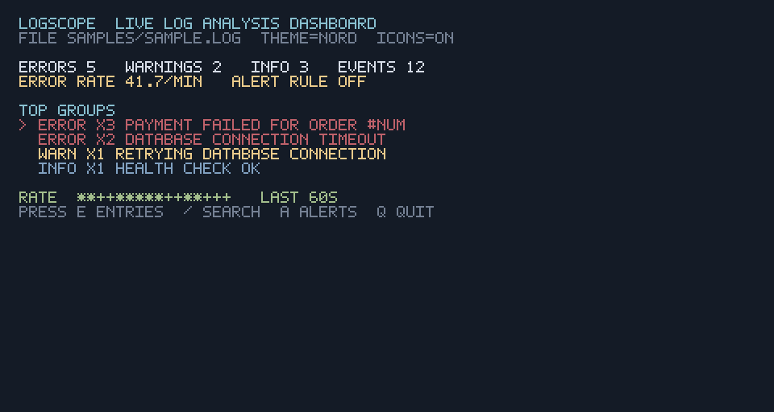

# logscope

`logscope` is a terminal-first log analysis and observability toolkit. It
turns noisy plain-text or JSONL logs into searchable entries, grouped errors,
rates, latency percentiles, anomaly reports, and a live dashboard — entirely
offline and without a hosted service.

## Quickstart

The repository includes a runnable log file, so a fresh checkout can produce
useful output in a few seconds:

```bash
git clone https://github.com/Cleverprogramer/logscope.git
cd logscope
bun install
bun run dev -- read sample.log --top 5
```

The same fixture works with the live dashboard:

```bash
bun run dev -- dashboard sample.log --theme nord --icons --banner
```

For a standalone executable, compile once and run the same commands without a
Bun runtime:

```bash
cd packages/cli
bun run compile
./dist/logscope stats ../../sample.log --json
```

The root `sample.log` is a copy of `samples/sample.log` kept for backwards
compatibility with tests and scripts. It deliberately mixes plain text and
JSONL, repeats error groups, includes a duration, and contains one malformed
line so the parser behavior is visible immediately.

The examples below use `logscope`. When running from source, prefix the
command with `bun run dev --`.

## See it in action



The demo is a silent, looping overview of the dashboard using the checked-in
sample log. If animation is unavailable, the complete [dashboard control
reference](#dashboard) describes the same workflow. Maintainers can rebuild
the asset with `bun run demo:gif`.

## Command reference

| Command | What it does | Example |
| --- | --- | --- |
| `read` | Parse files, globs, or stdin and print entries | `logscope read app.log --level error` |
| `tail` | Follow one file as lines arrive | `logscope tail app.log --alert-rate 10` |
| `stats` | Print totals, levels, and top groups once | `logscope stats app.log --json` |
| `dashboard` | Open the interactive live terminal UI | `logscope dashboard app.log --theme nord` |
| `correlate` | Measure whether one pattern precedes another | `logscope correlate app.log --before retry --after timeout` |
| `watch` | Re-render stats on an interval | `logscope watch app.log --interval 5` |
| `gaps` | Find silent periods in timestamped logs | `logscope gaps app.log --min-gap 10m` |
| `spikes` | Detect statistical level-rate anomalies | `logscope spikes app.log --bucket 5m` |
| `latency` | Extract durations and calculate p50/p95/p99 | `logscope latency app.log` |
| `advise` | Match frequent errors against offline rules | `logscope advise app.log --top 5` |
| `explain` | Show lines surrounding matching entries | `logscope explain app.log --before 5 --after 3` |
| `diff` | Compare message groups across two files | `logscope diff before.log after.log` |
| `completion` | Emit bash, zsh, or fish completions | `logscope completion zsh` |
| `serve` | Accept HTTP log posts and append them to a file | `logscope serve --port 7600 --out ingest.log` |
| `report` | Write a self-contained HTML or Markdown report | `logscope report app.log -o report.html` |

All file-taking commands accept multiple paths and shell globs where shown;
`-` reads stdin. Input files can mix plain-text and JSONL records. Unparseable
lines are retained as `UNKNOWN` entries so one bad line never aborts a run.

## Parsing and filtering

### `read` — inspect entries

```bash
logscope read app.log
logscope read logs/*.log --level error,warn --grep 'database|timeout' --since 2h
cat app.log | logscope read - --out jsonl > entries.ndjson
logscope read app.log --tz America/New_York --time-format 'HH:mm:ss.SSS'
logscope read app.log --format '{timestamp} [{level}] {message}'
```

Use `--quiet` to hide the summary and `--top 20` to change the number of
message groups shown. Human output supports `--compact` (minimal one-line
entries) and `--verbose` (metadata on a following line); these modes cannot be
combined. `--ascii` replaces Unicode markers for restricted terminals, and
`--icons` adds severity symbols while keeping the textual level visible.

`--out jsonl` emits one JSON object per entry without color or decoration,
which makes it safe to pipe into `jq`, another process, or a file.

### `tail` — follow a live file

```bash
logscope tail app.log -n 50
logscope tail app.log --poll-ms 500 --alert-rate 10 --notify
logscope tail app.log --compact --icons --out jsonl
```

`tail` detects truncation and rotation. `--alert-rate N` watches a rolling
60-second error window; `--notify` sends an operating-system notification when
the threshold fires.

## Analysis commands

### `stats` and `watch`

```bash
logscope stats app.log --level error --since 24h --top 10
logscope stats logs/*.log --json | jq '.levels'
logscope watch logs/*.log --interval 2 --top 8
```

`watch` repeatedly recomputes the same summary. Both commands support level
and time filters; `stats --json` is intended for scripts.

### `correlate` — sequence correlation

Measure how often a matching event is followed by another event within a
bounded window. Each preceding event is counted at most once.

```bash
logscope correlate app.log \
  --before 'WARN.*retry' --after 'ERROR.*timeout' --window 5m
logscope correlate logs/*.log --before 'retry' --after 'timeout' --json
```

The report includes matching counts, the number of successful pairs, and the
pairing rate. Matching is regex-based and works offline.

### `gaps`, `spikes`, and `latency`

```bash
logscope gaps app.log --min-gap 5m
logscope spikes app.log --bucket 1m --sensitivity 3 --level error
logscope latency app.log --level warn,error --grep 'duration|latency'
```

`gaps` requires timestamps and reports periods with no entries. `spikes` uses a
robust z-score over time buckets, so it is statistical rather than AI-based.
`latency` recognizes common duration forms such as `123ms`, `2.4s`, and
`duration=850ms`, then prints p50, p95, and p99 values.

### `advise`, `explain`, and `diff`

```bash
logscope advise app.log --top 10
logscope explain app.log --level error --before 10 --after 2
logscope explain app.log --grep 'payment failed' --before 5 --after 5
logscope diff deploy-before.log deploy-after.log --level error
```

`advise` uses the bundled offline known-error rules table. `explain` adds raw
context around matching entries. `diff` highlights groups that are new,
removed, or changed between two snapshots.

## Dashboard

```bash
logscope dashboard app.log --theme dracula --icons --banner
logscope dashboard app.log --level error --grep 'payment'
```

The dashboard shows summary boxes, a rate sparkline, ranked groups, and (when
enabled) an entry browser. Keyboard controls:

| Key | Action |
| --- | --- |
| `q` | Quit |
| `↑` / `↓` | Select a group or scroll entries |
| `Enter` | Expand the selected group |
| `e` | Toggle the entry browser |
| `/` | Search raw entries, then `Enter` to apply |
| `a` | Cycle the live error alert threshold |
| `Esc` | Close search or return from a detail view |

Mouse click selects or expands a group, and the wheel scrolls the current
list. SGR mouse support is enabled only while the dashboard is running.

### Themes and display options

Built-in themes are `default`, `dracula`, `solarized`, `monokai`, and `nord`:

```bash
logscope dashboard app.log --theme solarized
logscope dashboard app.log --ascii       # ASCII-only borders and markers
logscope dashboard app.log --icons       # severity symbols beside levels
```

`--banner` prints a compact startup banner. Dashboard panels can be hidden or
reordered through `.logscoperc` (see configuration below).

## Reports and integrations

### `report` — shareable output

```bash
logscope report app.log -o report.html
logscope report logs/*.log --md -o report.md
logscope report app.log --level error --since 7d --top 20
```

Without `-o`, the generated document is written to stdout. HTML reports are
self-contained; Markdown output is convenient for tickets and code review.

### `serve` — HTTP ingest

```bash
logscope serve --port 7600 --out ingest.log
curl -X POST --data-binary @app.log http://127.0.0.1:7600/logs
curl http://127.0.0.1:7600/healthz
logscope dashboard ingest.log
```

`POST /logs` appends the request body verbatim (adding a final newline when
needed). `GET /healthz` returns `ok`; all other routes return 404.

### `completion` — shell integration

```bash
logscope completion bash > ~/.local/share/bash-completion/completions/logscope
logscope completion zsh > ~/.zfunc/_logscope
logscope completion fish > ~/.config/fish/completions/logscope.fish
```

Source the generated file or restart your shell to activate completions.

## Configuration

Create `.logscoperc` in the working directory (or in your home directory for
user-wide defaults). A working example:

```json
{
  "level": "error,warn",
  "since": "24h",
  "top": "10",
  "tz": "UTC",
  "theme": "nord",
  "timeFormat": "HH:mm:ss.SSS",
  "colors": {
    "error": "red",
    "warn": "yellow",
    "accent": "cyan",
    "border": "blue"
  },
  "dashboard": {
    "panels": ["stats", "rate", "groups", "entries"]
  }
}
```

Supported panel names are `stats`, `rate`, `groups`, and `entries`. Explicit
CLI flags always override configuration. Invalid JSON, unknown themes, or
duplicate/unknown panel names fail fast with a useful error.

## Supported input

- Plain text with timestamps and levels, for example
  `2026-08-20 09:00:01 ERROR Payment failed`.
- JSON Lines with common aliases such as `timestamp`, `time`, `ts`, `level`,
  `severity`, `message`, and `msg`.
- Multiple files, shell globs, stdin, and mixed formats in one input.

Naive timestamps are treated as UTC for deterministic results. Use `--tz` to
convert displayed times to an IANA timezone. `--time-format` accepts the
tokens `YYYY`, `MM`, `DD`, `HH`, `mm`, `ss`, and `SSS`.

## Design and development

The parser → grouping → analysis → output/dashboard flow is documented in
[ARCHITECTURE.md](ARCHITECTURE.md) and kept in small, testable modules under
`packages/cli/src`. Development commands:

```bash
bun install
bun test
bun run typecheck
bun run dev -- stats sample.log
```

logscope is intentionally offline and heuristic. It does not send logs to an
AI service and the roadmap excludes AI root-cause hints, AI Git correlation,
and an AI-agent MCP server.

## License

MIT
